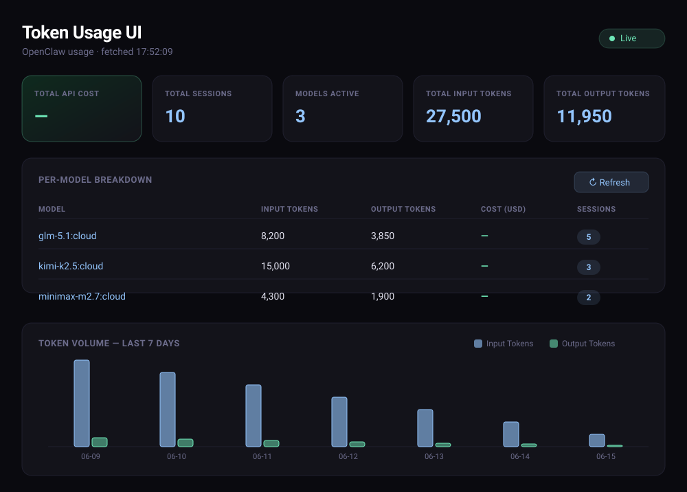

# Token Usage UI

A lightweight, zero-dependency dashboard for monitoring LLM token usage, cost,
and per-model breakdown — served by a single Python file and a single HTML page.

[](https://github.com/Walliiee/token-usage-ui/actions/workflows/ci.yml)
[](LICENSE)
[](https://www.python.org/)




> The preview above renders the built-in mock data. With a real `sessions.json`
> present, the dashboard shows your own usage.

## Features

- **At-a-glance summary** — total cost, sessions, active models, and input/output tokens.
- **Per-model breakdown** — tokens, estimated cost, and session count for every model.
- **7-day timeline** — daily input vs. output token volume, rendered with Chart.js.
- **Live auto-refresh** — polls every 8 seconds and pauses when the tab is hidden.
- **Cost estimation** — built-in pricing table with longest-prefix model matching.
- **No build step, no dependencies** — pure Python standard library + a single HTML file.

## Quick Start

```bash
git clone https://github.com/Walliiee/token-usage-ui.git
cd token-usage-ui
python3 server.py
```

Then open **http://localhost:8765** in your browser.

## Configuration

Both settings are read from environment variables:

| Variable       | Default        | Description                                  |
| -------------- | -------------- | -------------------------------------------- |
| `PORT`         | `8765`         | Port the dashboard is served on.             |
| `OPENCLAW_DIR` | `~/.openclaw`  | Base directory for the session data file.    |

```bash
OPENCLAW_DIR=/custom/path PORT=9000 python3 server.py
```

## Data Source

The server reads session records from:

```
$OPENCLAW_DIR/agents/main/sessions/sessions.json
```

It accepts either a JSON array of records or a JSON object whose values are
records. Each record uses the following fields:

```json
[
  {
    "model": "claude-sonnet-4-6",
    "inputTokens": 12000,
    "outputTokens": 3400,
    "startedAt": 1718467200000
  }
]
```

| Field          | Type            | Used for                                   |
| -------------- | --------------- | ------------------------------------------ |
| `model`        | string          | Grouping and pricing lookup.               |
| `inputTokens`  | number          | Token totals and cost.                     |
| `outputTokens` | number          | Token totals and cost.                     |
| `startedAt`    | epoch ms        | Bucketing sessions into the daily timeline.|

If the file is missing or unreadable, the API falls back to representative
**mock data** so the dashboard is still demoable out of the box.

### Pricing

Estimated cost is computed from `MODEL_PRICING` in [`server.py`](server.py),
which lists USD cost per 1M input/output tokens. Entries are matched
longest-prefix-first, so a dated model id (e.g. `claude-3-opus-20240229`) still
resolves to its family price. Unknown models are treated as free — adjust the
table to match your provider's current rates.

## Project Structure

```
token-usage-ui/
├── server.py            # stdlib HTTP server + /api/usage and /api/timeline
├── index.html           # single-page dashboard (HTML/CSS/JS)
├── tests/
│   └── test_server.py   # unit tests for pricing and aggregation
├── docs/
│   └── preview.svg      # dashboard preview used in this README
└── .github/workflows/   # CI: byte-compile + run tests on 3.9 / 3.11 / 3.12
```

## API

| Endpoint        | Description                                            |
| --------------- | ----------------------------------------------------- |
| `GET /`         | The dashboard.                                        |
| `GET /api/usage`| Aggregated per-model token usage and estimated cost.  |
| `GET /api/timeline` | Daily token usage time-series.                    |

## Development

Run the test suite (standard library only — no install required):

```bash
python3 -m unittest discover -s tests -v
```

## Tech

- Python standard-library HTTP server — no third-party packages
- [Chart.js](https://www.chartjs.org/) (via CDN) for the timeline
- [Inter](https://fonts.google.com/specimen/Inter) font (Google Fonts)
- A `Content-Security-Policy` header restricting scripts/styles to the CDNs used
- Dark theme, responsive layout

## License

[MIT](LICENSE) © Mike (Walliiee)
